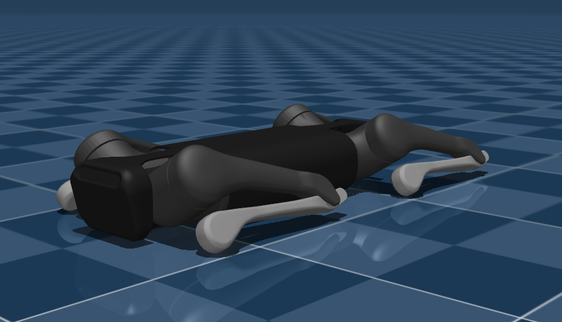

# Unitree Aliengo Description (MJCF)

## Overview

This package contains a simplified robot description (MJCF) of the [Aliengo
Quadruped Robot](https://www.unitree.com/aliengo) developed by [Unitree
Robotics](https://www.unitree.com/). It is derived from the [publicly available
URDF
description](https://github.com/unitreerobotics/unitree_ros/tree/master/robots/aliengo_description).

