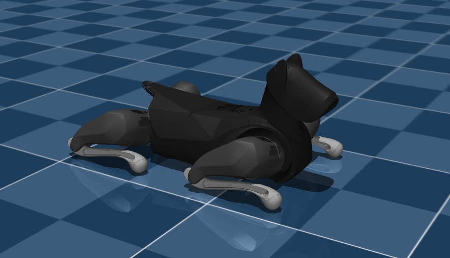

# Xiaomi Cyberdog2 Description (MJCF)

## Overview

This package contains a simplified robot description (MJCF) of the [Cyberdog2
Quadruped Robot](https://www.mi.com/cyberdog2) developed by [MiRoboticsLab](https://github.com/MiRoboticsLab). It is derived from the [publicly available
URDF
description](https://github.com/MiRoboticsLab/cyberdog_simulator/tree/main/cyberdog_robot/cyberdog_description).

