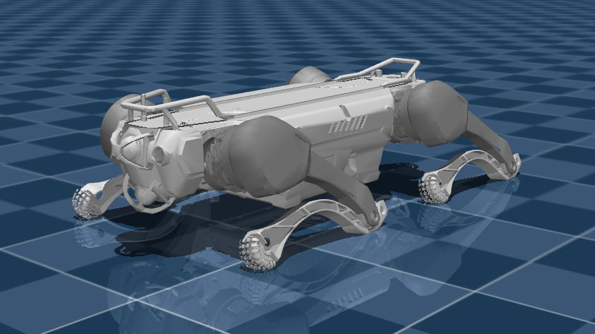

# Deep Robotics X30 Description (MJCF)

## Overview

This package contains a simplified robot description (MJCF) of the [X30
Quadruped Robot](https://www.deeprobotics.cn/robot/index/product3.html) developed by [Deep Robotics ](https://www.deeprobotics.cn/robot/index/index.html). It is derived from the [publicly available
URDF
description](https://github.com/DeepRoboticsLab/URDF_model/tree/main/x30_urdf/X30).

